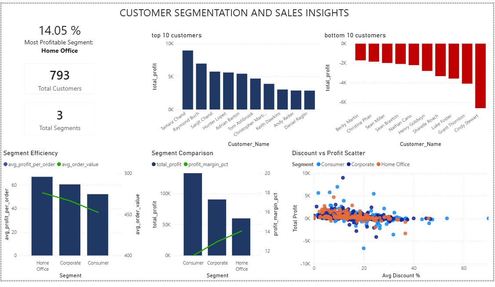

# Customer Segmentation & Sales Insights | FY2014–2017

## Project Summary
Commercial analysis of 793 customers across three business segments,
identifying profitability drivers, quantifying the impact of discounting
at the customer level, and recommending segment investment and discount
control strategies.

This project replicates the core workflow of a commercial/insights analyst:
SQL-based segmentation analysis, Power BI dashboard, and findings
communicated via an executive decision memo.

---

## Business Questions Answered
- Which customer segments are most and least profitable?
- Who are the top and bottom customers by profit contribution?
- What is the relationship between discounting and customer profitability?
- Where should commercial focus shift to improve margin?

---

## Key Findings
- **Home Office delivers the highest margin (14.05%)** and profit per order
  ($66.92) despite being the smallest segment — it is underinvested relative
  to its commercial value
- **Every loss-making customer carries 20%+ average discount** — discount
  discipline, not demand, is the root cause of customer-level losses
- **Sean Miller generates $25K revenue but loses $1,981** — high revenue
  is masking negative profit at the customer level across multiple accounts

---

## Recommendations
1. Prioritise Home Office segment growth — highest quality, lowest volume
2. Implement customer-level discount controls for all accounts above 20%
3. Introduce profit per order as a sales KPI alongside revenue targets

**Estimated impact: $30K+ immediate profit recovery, 15%+ overall margin**

---

## Tools Used
- **MySQL** — customer segmentation queries, top/bottom customer analysis,
  repeat purchase and efficiency analysis
- **Power BI** — interactive dashboard with segment KPIs, customer
  profitability ranking, discount vs profit scatter, segment efficiency
- **PDF** — executive decision memo with commercial recommendations

---

## Files in This Repository
| File | Description |
|---|---|
| `query1_segment_performance.csv` | Segment-level profitability analysis |
| `query2_top10_customers.csv` | Top 10 customers by profit |
| `query3_bottom10_customers.csv` | Bottom 10 loss-making customers |
| `query4_segment_efficiency.csv` | Orders, value and profit per segment |
| `Customer_Segmentation_Decision_Memo.pdf` | One-page executive recommendation |
| `dashboard_screenshot.png` | Power BI dashboard |

---

## Dashboard Preview

---

## Data Source
Sample Superstore dataset — publicly available via Kaggle.

---

## Author
**Milind Thapar**
[LinkedIn](https://www.linkedin.com/in/milindthapar) |
[GitHub](https://github.com/milindthapar)
